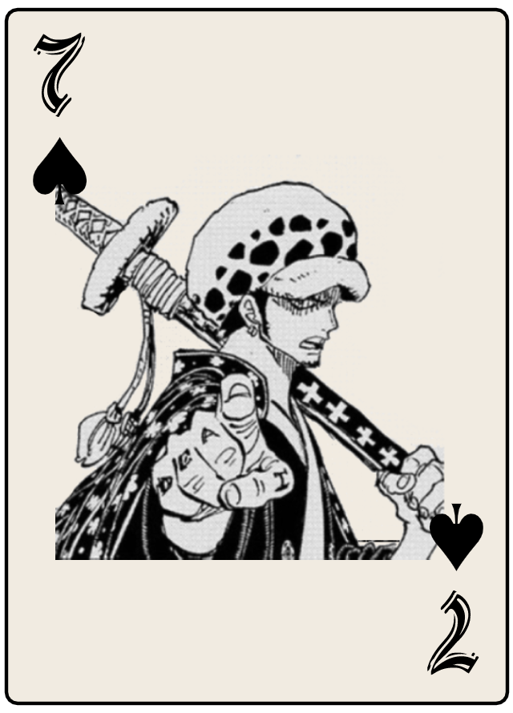

# Wano Blackjack

## High Concept
The game of blackjack themed after the popular anime One Piece.

## Genre
Card game

## Platform
Desktop and Mobile

## Story
You walk into a casino and play blackjack

## Esthetic
### Graphics
Visuals inspired by classic japanese art.

### Sound
The cards will make noise when they are distrubuted and shuffled. There will also be feedback for special situations, such as blackjack or running out of chips. However, there will be no music.

## Gameplay
### Mechanics

### Control
The game will be played with the mouse or touch controls on mobile.

### Onboarding
Since blackjack is a somewhat simple game, a lot 
### Player learning

## Screenshots

## Other

## Developer